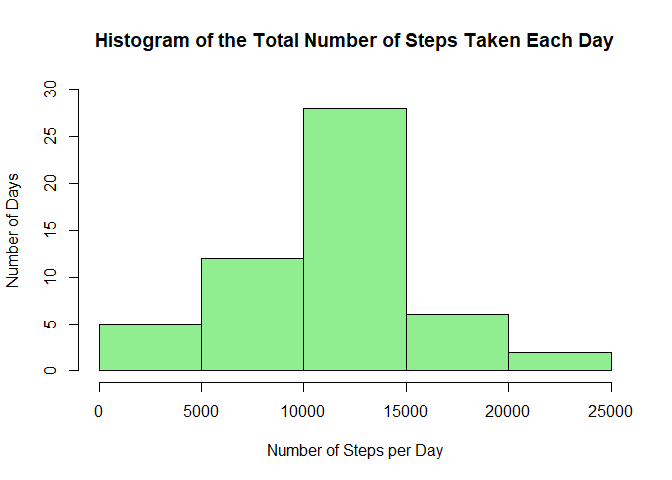

This Markdown document fulfills the requirements of the *Peer-graded Assignment: Course Project 1* for the 
**Reproducible Research** Coursera class. The data source, steps, and instructions are in README.md.

## Loading and preprocessing the data

Assuming that the data is in your working directory, this code will read in table and assign it to *rawdata*:


```r
rawdata <- read.csv("activity.csv")
str(rawdata)
```

```
## 'data.frame':	17568 obs. of  3 variables:
##  $ steps   : int  NA NA NA NA NA NA NA NA NA NA ...
##  $ date    : Factor w/ 61 levels "2012-10-01","2012-10-02",..: 1 1 1 1 1 1 1 1 1 1 ...
##  $ interval: int  0 5 10 15 20 25 30 35 40 45 ...
```

To work the required analysis, the raw data needs to processed. The processed dataframe is called *data* and date column is changed from factor to date.


```r
data <- rawdata
data$date <- as.Date(data$date, format= c("%Y-%m-%d"))
str(data)
```

```
## 'data.frame':	17568 obs. of  3 variables:
##  $ steps   : int  NA NA NA NA NA NA NA NA NA NA ...
##  $ date    : Date, format: "2012-10-01" "2012-10-01" ...
##  $ interval: int  0 5 10 15 20 25 30 35 40 45 ...
```


## What is mean total number of steps taken per day?


To calculate the total number of steps for a given day, the *data* df needs to be grouped by date and summarized. The new df is called **dfsumsteps**, and the total number of steps per day is in the column *totsteps*.  
I have also introduced the *dplyr* R package in my code.


```r
library(dplyr)
dfsumsteps <- data %>%
        select(date, steps) %>%
        group_by(date) %>%
        summarise(totsteps= sum(steps))
head(dfsumsteps)
```

```
## # A tibble: 6 x 2
##   date       totsteps
##   <date>        <int>
## 1 2012-10-01       NA
## 2 2012-10-02      126
## 3 2012-10-03    11352
## 4 2012-10-04    12116
## 5 2012-10-05    13294
## 6 2012-10-06    15420
```


#### Here is a histogram of the total number of steps per day:


```r
hist(dfsumsteps$totsteps, main="Histogram of the Total Number of Steps Taken Each Day",
     xlab="Number of Steps per Day", ylab="Number of Days",ylim=c(0,30), col="lightgreen")
```

<!-- -->

##### Calculation of the **mean**:


```r
mean(dfsumsteps$totsteps,na.rm=TRUE)
```

```
## [1] 10766.19
```


##### And the **median**:

```r
median(dfsumsteps$totsteps, na.rm=TRUE)
```

```
## [1] 10765
```


## What is the average daily activity pattern?


## Imputing missing values


## Are there differences in activity patterns between weekdays and weekends?
