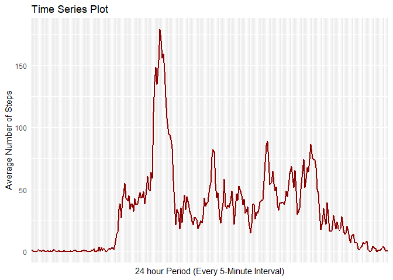
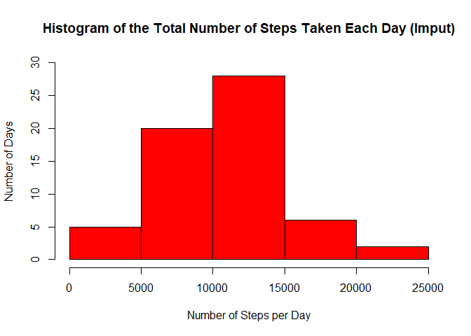
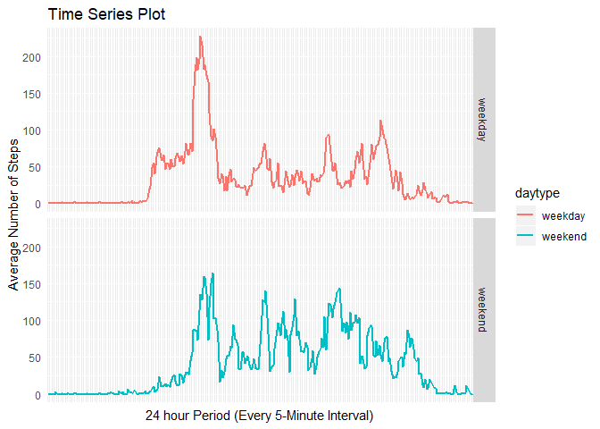

This Markdown document fulfills the requirements of the *Peer-graded Assignment: Course Project 1* for the 
**Reproducible Research** Coursera class. The data source, steps, and instructions are in README.md.
&nbsp; 

## Loading and preprocessing the data

Assuming that the data is in your working directory, this code will read in table and assign it to *rawdata*:


```r
rawdata <- read.csv("activity.csv")
str(rawdata)
```

```
## 'data.frame':	17568 obs. of  3 variables:
##  $ steps   : int  NA NA NA NA NA NA NA NA NA NA ...
##  $ date    : Factor w/ 61 levels "2012-10-01","2012-10-02",..: 1 1 1 1 1 1 1 1 1 1 ...
##  $ interval: int  0 5 10 15 20 25 30 35 40 45 ...
```
&nbsp; 

To work the required analysis, the raw data needs to processed. The processed dataframe is called **data** and *date* column is changed from factor to date and the *interval* variable changed to factor. I have also added a *timeofday*.


```r
data <- rawdata
data$date <- as.Date(data$date, format= c("%Y-%m-%d"))
data$timeofday <- format(strptime(substr(as.POSIXct(sprintf("%04.0f", data$interval), 
                                  format="%H%M"), 12, 16), '%H:%M'), '%I:%M %p')
data$interval <- as.factor(data$interval)
str(data)
```

```
## 'data.frame':	17568 obs. of  4 variables:
##  $ steps    : int  NA NA NA NA NA NA NA NA NA NA ...
##  $ date     : Date, format: "2012-10-01" "2012-10-01" ...
##  $ interval : Factor w/ 288 levels "0","5","10","15",..: 1 2 3 4 5 6 7 8 9 10 ...
##  $ timeofday: chr  "12:00 AM" "12:05 AM" "12:10 AM" "12:15 AM" ...
```
&nbsp; 

## What is mean total number of steps taken per day?


To calculate the total number of steps for a given day, the *data* df needs to be grouped by date and summarized. The new df is called **dfsumsteps**, and the total number of steps per day is in the column *totsteps*.  
I have also introduced the *dplyr* R package in my code.


```r
library(dplyr)
dfsumsteps <- data %>%
        select(date, steps) %>%
        group_by(date) %>%
        summarise(totsteps= sum(steps))
head(dfsumsteps)
```

```
## # A tibble: 6 x 2
##   date       totsteps
##   <date>        <int>
## 1 2012-10-01       NA
## 2 2012-10-02      126
## 3 2012-10-03    11352
## 4 2012-10-04    12116
## 5 2012-10-05    13294
## 6 2012-10-06    15420
```
&nbsp; 

#### Here is a histogram of the total number of steps per day:


```r
hist(dfsumsteps$totsteps, main="Histogram of the Total Number of Steps Taken Each Day",
     xlab="Number of Steps per Day", ylab="Number of Days",ylim=c(0,30), col="lightgreen")
```

<!-- -->

##### Calculation of the **mean** total number of steps taken per day:


```r
mean(dfsumsteps$totsteps,na.rm=TRUE)
```

```
## [1] 10766.19
```


##### And the **median** total number of steps taken per day:

```r
median(dfsumsteps$totsteps, na.rm=TRUE)
```

```
## [1] 10765
```
&nbsp; 

## What is the average daily activity pattern?

Below is a time series plot of the 5-minute interval (x-axis) and the average number of steps taken, averaged across all days (y-axis), using the ggplot2 package.

A summarized new data frame (**dfint**) is required for the plot input:


```r
dfint <- data %>%
        select(interval, steps, timeofday) %>%
        group_by(interval, timeofday) %>%
        summarise(avgsteps = sum(steps, na.rm = TRUE)/n())
head(dfint)
```

```
## # A tibble: 6 x 3
## # Groups:   interval [6]
##   interval timeofday avgsteps
##   <fct>    <chr>        <dbl>
## 1 0        12:00 AM    1.49  
## 2 5        12:05 AM    0.295 
## 3 10       12:10 AM    0.115 
## 4 15       12:15 AM    0.131 
## 5 20       12:20 AM    0.0656
## 6 25       12:25 AM    1.82
```


```r
library(ggplot2)
ggplot(data = dfint, aes(x = interval, y = avgsteps, group = 1)) +
        geom_line(color = "darkred", size = 1) +
        xlab("24 hour Period (Every 5-Minute Interval)") + ylab("Average Number of Steps") +
        ggtitle("Time Series Plot") + theme(axis.text.x = element_blank(), axis.ticks = element_blank())
```

<!-- -->
&nbsp; 

Here is some code that returns which 5-minute interval, on average across all the days in the dataset, contains the maximum number of steps:


```r
maxvalue <- max(dfint$avgsteps)
dfint$timeofday[dfint$avgsteps==maxvalue]
```

```
## [1] "08:35 AM"
```
&nbsp; 

## Imputing missing values


Note that there are a number of days/intervals where there are missing values (coded as `NA`). This may introduce bias into some calculations or summaries of the data.

Let's get a sense of the magnitude of 'NA'.

```r
colSums(is.na(rawdata))
```

```
##    steps     date interval 
##     2304        0        0
```

The approach I took for imputing the 2,304 missing values in the dataset was use the mean for that 5-minute interval. A new data frame called **dataimp** contains the imputed data. Here is the code I used to create it:


```r
dataimp <- data
for(i in 1:nrow(dataimp)){
        if (is.na(dataimp$steps[i])){
                dataimp$steps[i] <- round(dfint$avgsteps[dfint$interval==dataimp$interval[i]])
        }
        else{
                dataimp$steps <- dataimp$steps
        }
}
head(dataimp)
```

```
##   steps       date interval timeofday
## 1     1 2012-10-01        0  12:00 AM
## 2     0 2012-10-01        5  12:05 AM
## 3     0 2012-10-01       10  12:10 AM
## 4     0 2012-10-01       15  12:15 AM
## 5     0 2012-10-01       20  12:20 AM
## 6     2 2012-10-01       25  12:25 AM
```
&nbsp; 

The updated histogram, using the summarized **dataimp** df, shows a difference in the distribution of the total daily steps than that of the above example which ignored NAs.


```r
dfimpsumsteps <- dataimp %>%
        select(date, steps) %>%
        group_by(date) %>%
        summarise(totsteps= sum(steps))
hist(dfimpsumsteps$totsteps, main="Histogram of the Total Number of Steps Taken Each Day (Imput)",
     xlab="Number of Steps per Day", ylab="Number of Days",ylim=c(0,30), col="red")
```

<!-- -->
&nbsp; 

The **mean**...

```r
mean(dfimpsumsteps$totsteps)
```

```
## [1] 10580.72
```
and **median** have also been updated.

```r
median(dfimpsumsteps$totsteps)
```

```
## [1] 10395
```
&nbsp; 


## Are there differences in activity patterns between weekdays and weekends?
&nbsp; 

To see the differences in activity between weekdays and weekends, I created a new factor variable in the dataset with two levels -- "weekday" and "weekend" indicating whether a given date is a weekday or weekend day.

```r
dataimp$weekday <- weekdays(dataimp$date) #new variable showing day of week

for (rec in 1:nrow(dataimp)){
        if (dataimp$weekday[rec]=="Saturday"| dataimp$weekday[rec]=="Sunday"){
                dataimp$daytype[rec] <- "weekend"
        }
        else{
                dataimp$daytype[rec] <- "weekday"
        }
        
}
dataimp$daytype <- as.factor(dataimp$daytype)
head(dataimp)
```

```
##   steps       date interval timeofday weekday daytype
## 1     1 2012-10-01        0  12:00 AM  Monday weekday
## 2     0 2012-10-01        5  12:05 AM  Monday weekday
## 3     0 2012-10-01       10  12:10 AM  Monday weekday
## 4     0 2012-10-01       15  12:15 AM  Monday weekday
## 5     0 2012-10-01       20  12:20 AM  Monday weekday
## 6     2 2012-10-01       25  12:25 AM  Monday weekday
```
&nbsp; 

To make a panel plot containing a time series plot of the 5-minute interval (x-axis) and the average number of steps taken, averaged across all weekday days or weekend days (y-axis), I would first need to summarize the imputed data.


```r
dfint2 <- dataimp %>%
        select(interval, steps, daytype) %>%
        group_by(interval, daytype) %>%
        summarise(avgsteps = sum(steps)/n())
```

Then, use ggplot for the final time series graphic.


```r
ggplot(data = dfint2, aes(x = interval, y = avgsteps, group = 1, color=daytype)) +
        geom_line(size = 1)  + facet_grid(rows = vars(daytype)) +
        xlab("24 hour Period (Every 5-Minute Interval)") + ylab("Average Number of Steps") +
        ggtitle("Time Series Plot") + theme(axis.text.x = element_blank(), axis.ticks = element_blank())
```

<!-- -->

